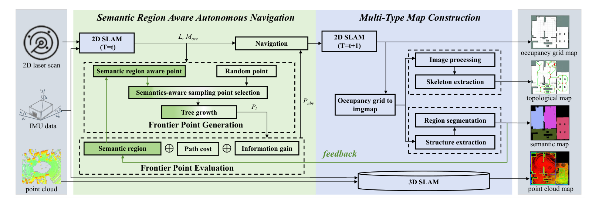

# Semantic Region Aware Autonomous Exploration for Multi-Type Map Construction in Unknown Environments

## Overview

## Abstract

Autonomous exploration is the task that a robot actively plans the paths to autonomously move in unknown environments, during the procedure of which environment maps are synchronously constructed to gradually reduce environmental uncertainty. Existing autonomous exploration methods usually suffer from excessively-repeated explorations for the same region in an environment, leading to long exploration time and exploration trajectory. To address this issue, we propose a semantic region aware autonomous exploration method, and the core idea is optimizing the autonomous navigation strategy by involving the information of semantic regions. Our method avoids excessively-repeated explorations and accelerates the exploration speed. In addition, compared with existing autonomous exploration methods that usually construct the single-type map, our method allows to simultaneously construct four types of maps including point cloud map, occupancy grid map, topological map, and semantic map. Experiments are conducted in both simulated and real-world environments. Simulation experiments demonstrate that our method achieves the highest 52.1% reduction in exploration time and 45.2% reduction in exploration trajectory length while maintaining an exploration rate of >98%. In real-world experiments, our method asks for the shortest exploration time and the shortest trajectory length when comparing with existing methods.
